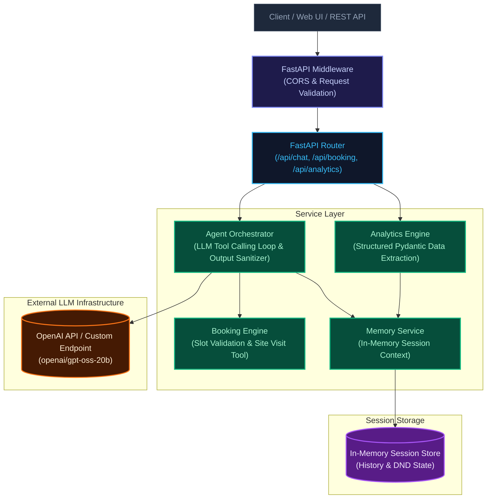

# Northstar Homes — AI Conversational Sales Agent

Loom Video Link : https://www.loom.com/share/b71b73212f034effa854cbf776c6d33e

## 1. System Overview

Northstar Homes AI Sales Agent is a conversational real estate assistant built with FastAPI (Python) and OpenAI LLM infrastructure (openai/gpt-oss-20b). The system is designed to handle customer inquiries, lead qualification, objection management, and site visit bookings for the Northstar One project located in Sector 79, Gurugram.

Key Project Parameters:
- Project Name: Northstar One
- Location: Sector 79, Gurugram
- Configurations: 2 BHK (starting at INR 1.35 Crore onwards) and 3 BHK (starting at INR 1.75 Crore onwards)
- Supported Languages: English, Hindi, and Hinglish (code-switched conversational flow)
- Backend Framework: FastAPI (Python)
- LLM Provider: OpenAI API (openai/gpt-oss-20b)

## 2. Prompt Engineering Strategy & Dual-Mode Compatibility

The system prompt in app/core/prompt.py is engineered to work across both chat interfaces and voice/calling interactions:
- Text-to-Speech Compatibility: The prompt strictly forbids markdown formatting (asterisks, bold headers, bullet lists, tables) so TTS engines can read outputs cleanly without pronunciation anomalies.
- Turn Brevity: Responses are restricted to 2-3 concise sentences to mimic spoken conversation.
- Language Switch Flexibility: Seamlessly responds in English, Hindi, or Hinglish depending on user input context.
- Factual Guardrails: Prevents hallucination of prices, floor plans, discounts, or specifications not explicitly provided.
- Behavioral Logic: Handles lead qualification, pricing objections, location concerns, unknown detail deferral, site visit scheduling, booking failure recovery, human escalation, and DND/opt-out requests.

## 3. Architecture & Request Pipeline



## 4. Quick Start & Execution Guide

Clone the repository and navigate to the project directory.

Create and activate a virtual environment:
```bash
python3 -m venv venv
source venv/bin/activate
```

Install dependencies:
```bash
pip install -r requirements.txt
```

Configure environment variables in .env:
```ini
GROQ_API_KEY=your_groq_api_key
OPENAI_BASE_URL=https://api.openai.com/v1
LLM_MODEL=openai/gpt-oss-20b
```

Start the Uvicorn application server:
```bash
python run.py
```
or:
```bash
uvicorn app.main:app --host 0.0.0.0 --port 8000 --reload
```

Access the Web Interface in your browser at http://localhost:8000.

## 5. End-to-End Test Scenarios & Results

The system implements five specific conversational verification scenarios to ensure compliant dialogue behaviors and structured data extraction.

### Scenario 1: Hinglish Information & Lead Qualification
- Input: "Sector 79 me 3 BHK starting price kitna hai and amenities kya hain?"
- Expected Behavior: Responds in conversational Hinglish quoting the starting price of 1.75 Crore, lists primary amenities, and continues qualification without using markdown formatting.
- Actual Output: "Northstar One mein 2 BHK ka price 1.35 Crore se aur 3 BHK ka price 1.75 Crore se start hota hai. Project mein clubhouse, swimming pool, aur gym jaisi premium amenities hain. Aapki kya requirement hai?"

### Scenario 2: Site Visit Booking Success
- Input: "I want to book a visit for tomorrow at 4 PM. Name is Vikram Singh, phone 9988776655, interested in 3 BHK."
- Expected Behavior: Executes the booking engine tool with the parsed values, saves a success record, and responds with a confirmation message.
- Actual Output: "Thank you, Vikram Singh. Your site visit for Northstar One is successfully confirmed for Tomorrow at 4:00 PM. We look forward to meeting you."

### Scenario 3: Booking Failure & Fallback Handling
- Input: "Book a visit for year 2020 at 10 AM, Name: Amit, Phone: 9123456789."
- Expected Behavior: Booking engine validates that the date is in the past, returns a validation failure, and the agent asks for a future slot or offers a human callback.
- Actual Output: "I apologize, Amit, but that slot is unavailable or invalid since it is in the past. Could you please suggest a future date, or would you prefer a call back?"

### Scenario 4: Hallucination Guardrail & Escalation
- Input: "Can I get a 20% festive discount and what is the exact ceiling height in feet?"
- Expected Behavior: Refuses to invent prices, discounts, or specs not provided in the knowledge base, offering instead to escalate to a human specialist.
- Actual Output: "I don't have the exact details on the festive discount or ceiling height right now, but I can arrange for our senior specialist to call you with the complete details."

### Scenario 5: Opt-Out / Stop Request
- Input: "I am not interested, stop contacting me."
- Expected Behavior: Acknowledges the opt-out request, flags the session as opted out in memory, and ceases further message processing.
- Actual Output: "Understood, I have updated our records and you will not receive further messages from us. Have a great day."

## 6. Assumptions and Limitations

- Site visit bookings are simulated within the service layer.
- Session context is managed in-memory per application instance (extensible to Redis for distributed horizontal scaling).
- Pricing and specs are restricted to Sector 79 project parameters provided in the prompt assignment.

## 7. AI Tools Used

- OpenAI API (openai/gpt-oss-20b) for LLM inference.
- FastAPI framework for ASGI web routing.
